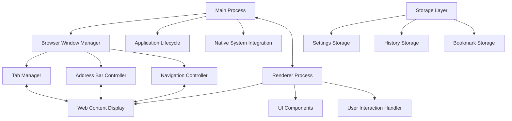
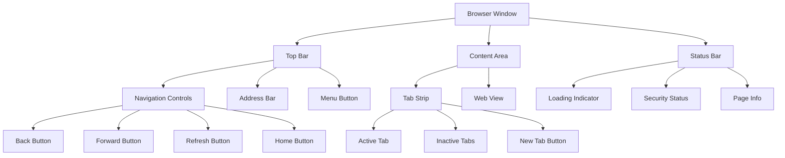
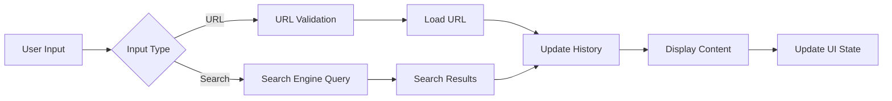
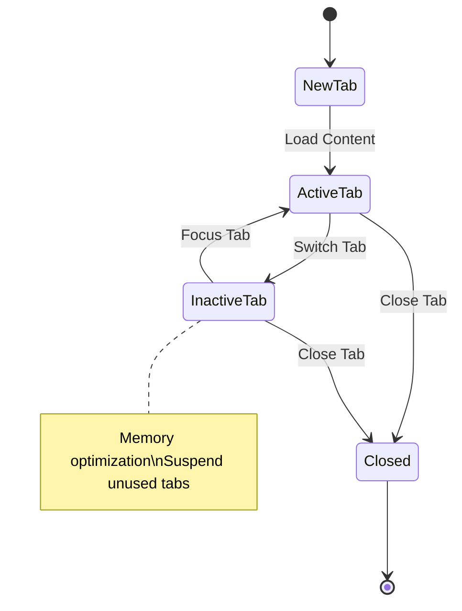
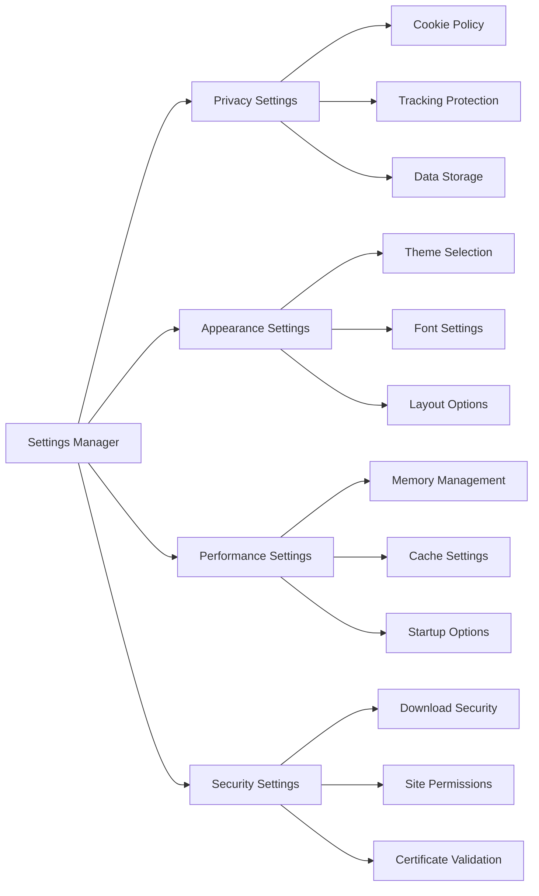
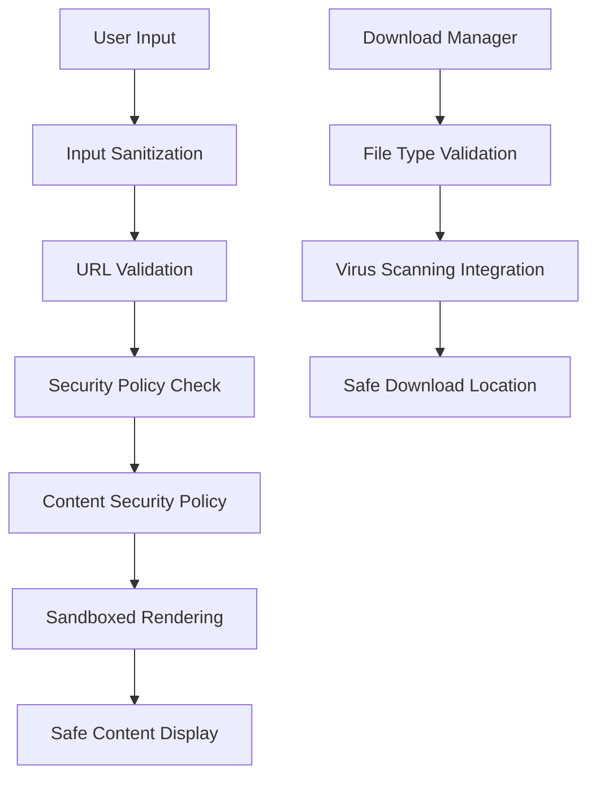

# Minimalistic Browser - Design Document

## Overview

### Project Vision
A completely original, clean, and minimalistic desktop browser application that serves as a fresh alternative to mainstream browsers like Brave, Edge, Chrome, and Firefox. The browser emphasizes simplicity, speed, and user-focused design without any influence from existing browser aesthetics.

### Core Values
- **Minimalism**: Clean interface with only essential elements
- **Performance**: Fast browsing experience with optimized resource usage
- **Privacy**: User-centric privacy controls
- **Originality**: Unique design language distinct from all existing browsers
- **Simplicity**: Intuitive user experience without complexity

### Target Users
- Users seeking alternatives to mainstream browsers
- Privacy-conscious individuals
- Users who prefer minimalistic software design
- Power users wanting customizable browsing experience

## Technology Stack & Dependencies

### Core Framework
- **Electron ^27.0.0**: Cross-platform desktop application framework
- **Node.js**: Backend runtime for main process
- **Chromium**: Rendering engine (embedded in Electron)

### Development Tools
- **electron-builder ^24.6.0**: Application packaging and distribution
- **Native HTML/CSS/JavaScript**: Frontend implementation

### Build System
- NPM scripts for development and production builds
- Cross-platform packaging (Windows NSIS, macOS DMG, Linux AppImage)

## Architecture

### Overall System Design



### Process Architecture
- **Main Process**: Manages application lifecycle, window creation, and system integration
- **Renderer Process**: Handles UI rendering and web content display
- **IPC Communication**: Secure communication between main and renderer processes

### Core Components

#### Browser Window Manager
- Creates and manages browser windows
- Handles window state (minimize, maximize, close)
- Manages multiple window instances

#### Tab Management System
- Tab creation, switching, and closing
- Tab state persistence
- Memory optimization for inactive tabs

#### Navigation Engine
- URL processing and validation
- History management
- Bookmark system integration

## Component Architecture

### UI Component Hierarchy



### Component Specifications

#### Top Navigation Bar
- **Height**: 48px
- **Background**: Clean gradient or solid color
- **Elements**: Back/Forward buttons, Address bar, Menu button
- **Layout**: Horizontal flex layout

#### Address Bar
- **Input Type**: URL/Search combined field
- **Features**: Auto-completion, search suggestions, security indicators
- **Width**: Flexible, expands with window size
- **Styling**: Rounded corners, subtle shadow

#### Tab Strip
- **Position**: Below navigation bar
- **Tab Design**: Minimalistic with close buttons
- **Max Tabs**: Configurable limit with scroll
- **New Tab**: Always visible "+" button

#### Web View Container
- **Engine**: Chromium (via Electron webContents)
- **Security**: Sandboxed content
- **Features**: Zoom controls, developer tools access

## Core Features Architecture

### Navigation System



### Tab Management



### Settings & Configuration



## Data Models & Storage

### Browser State Model
```
BrowserState {
  windows: Window[]
  activeWindowId: string
  settings: Settings
  history: HistoryEntry[]
  bookmarks: Bookmark[]
}
```

### Window Model
```
Window {
  id: string
  tabs: Tab[]
  activeTabId: string
  bounds: WindowBounds
  isMaximized: boolean
}
```

### Tab Model
```
Tab {
  id: string
  url: string
  title: string
  favicon: string
  isLoading: boolean
  canGoBack: boolean
  canGoForward: boolean
  lastAccessed: timestamp
}
```

### Storage Implementation
- **Settings**: JSON file in user data directory
- **History**: SQLite database for efficient querying
- **Bookmarks**: JSON file with hierarchical structure
- **Cache**: Chromium's built-in caching system

## UI/UX Design Philosophy

### Design Principles
1. **Less is More**: Remove unnecessary visual elements
2. **Functional Beauty**: Every element serves a purpose
3. **Consistent Spacing**: 8px grid system
4. **Subtle Animations**: Smooth transitions without distraction
5. **Accessibility**: High contrast, keyboard navigation

### Color Scheme (Minimalistic)
- **Primary Background**: #FFFFFF / #1A1A1A (light/dark)
- **Secondary Background**: #F8F9FA / #2D2D2D
- **Text Primary**: #212529 / #FFFFFF
- **Text Secondary**: #6C757D / #AAAAAA
- **Accent Color**: #007BFF (customizable)
- **Border Color**: #DEE2E6 / #404040

### Typography
- **Primary Font**: System font stack (San Francisco, Segoe UI, Roboto)
- **Font Sizes**: 14px (body), 16px (input), 12px (secondary)
- **Font Weights**: Regular (400), Medium (500), Bold (600)

### Spacing System
- **Base Unit**: 8px
- **Component Padding**: 16px
- **Element Margin**: 8px, 16px, 24px
- **Border Radius**: 4px (small), 8px (medium)

## Routing & Navigation

### URL Handling Flow
1. **Input Processing**: Detect URL vs search query
2. **URL Validation**: Check protocol and format
3. **Security Check**: Validate against blocked sites
4. **Navigation**: Load content in active tab
5. **History Update**: Add to browsing history
6. **UI Update**: Refresh address bar and tab title

### Navigation States
- **Loading**: Show progress indicator
- **Loaded**: Display content, update UI
- **Error**: Show error page with retry options
- **Blocked**: Display security warning

## Security Architecture

### Security Layers



### Privacy Features
- **No Tracking**: No user data collection by browser
- **Local Storage**: All data stored locally
- **Private Browsing**: Isolated session mode
- **Cookie Management**: Granular cookie controls
- **HTTPS Enforcement**: Prefer secure connections

## Performance Optimization

### Memory Management
- **Tab Suspension**: Inactive tabs release memory
- **Cache Optimization**: Intelligent cache sizing
- **Resource Limiting**: CPU and memory caps
- **Garbage Collection**: Regular cleanup cycles

### Startup Optimization
- **Fast Boot**: Minimal startup dependencies
- **Session Restore**: Quick tab restoration
- **Background Loading**: Preload frequently visited sites
- **Lazy Loading**: Load UI components on demand

## Testing Strategy

### Unit Testing
- **Component Tests**: Individual UI component testing
- **Service Tests**: Navigation and tab management logic
- **Storage Tests**: Data persistence and retrieval
- **Security Tests**: Input validation and sanitization

### Integration Testing
- **Window Management**: Multi-window scenarios
- **Tab Operations**: Create, switch, close tabs
- **Navigation Flow**: URL loading and history
- **Settings Persistence**: Configuration save/load

### End-to-End Testing
- **User Workflows**: Complete browsing sessions
- **Performance Testing**: Memory and CPU usage
- **Cross-Platform**: Windows, macOS, Linux compatibility
- **Accessibility Testing**: Keyboard and screen reader support

### Testing Tools
- **Jest**: Unit testing framework
- **Spectron**: Electron application testing
- **Puppeteer**: Browser automation for E2E tests
- **Performance Profiling**: Chrome DevTools integration

## Development Workflow

### Project Structure
```
src/
├── main/
│   ├── main.js              # Electron main process
│   ├── window-manager.js    # Window creation and management
│   ├── menu.js              # Application menu
│   └── ipc-handlers.js      # Inter-process communication
├── renderer/
│   ├── index.html           # Main UI template
│   ├── styles/
│   │   ├── main.css         # Core styles
│   │   ├── components.css   # Component styles
│   │   └── themes.css       # Theme definitions
│   ├── scripts/
│   │   ├── app.js           # Main application logic
│   │   ├── navigation.js    # Navigation handling
│   │   ├── tabs.js          # Tab management
│   │   └── settings.js      # Settings management
│   └── components/
│       ├── address-bar.js   # Address bar component
│       ├── tab-strip.js     # Tab strip component
│       └── menu.js          # Menu component
├── services/
│   ├── storage.js           # Data persistence
│   ├── history.js           # Browsing history
│   ├── bookmarks.js         # Bookmark management
│   └── security.js          # Security utilities
└── assets/
    ├── icons/               # Application icons
    ├── images/              # UI images
    └── fonts/               # Custom fonts (if any)
```

### Build Process
1. **Development**: `npm run dev` for live development
2. **Testing**: Run unit and integration tests
3. **Building**: `npm run build` for production build
4. **Packaging**: `electron-builder` for distribution packages
5. **Distribution**: Platform-specific installers

### Code Standards
- **ES6+ JavaScript**: Modern JavaScript features
- **CSS3**: Modern CSS with flexbox/grid
- **Semantic HTML**: Accessible markup structure
- **Comments**: JSDoc for functions and complex logic
- **Linting**: ESLint for code quality
- **Formatting**: Prettier for consistent formatting