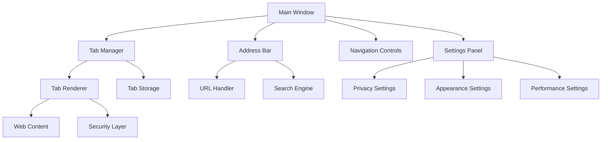
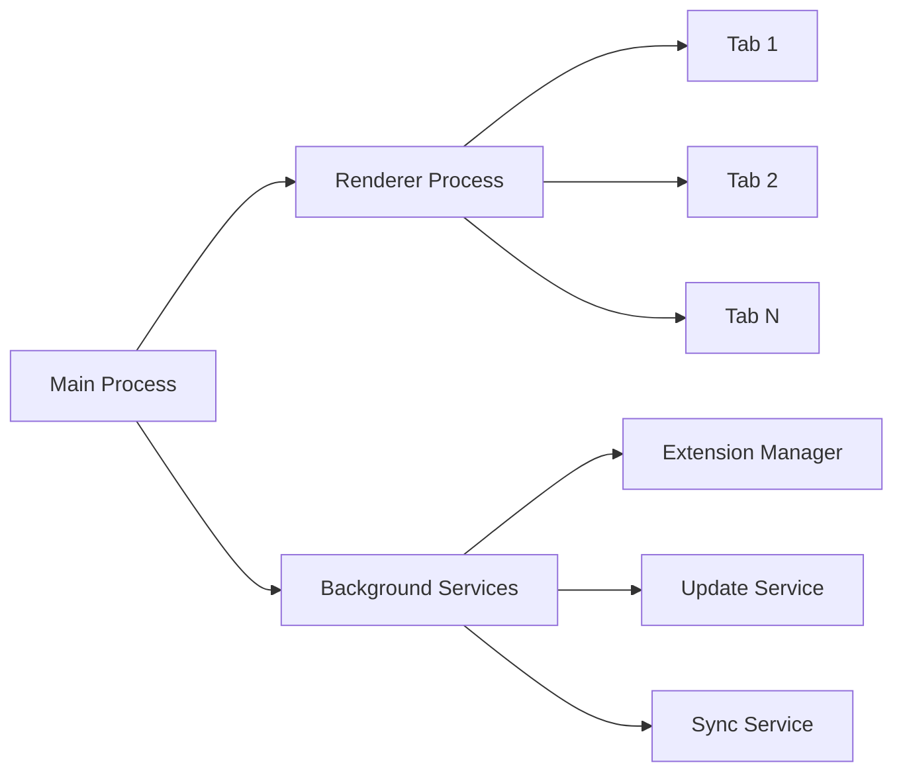

# Minimalistic Browser Design

## Overview

A clean, minimalistic web browser designed as an alternative to Brave, Edge, and other mainstream browsers. The browser will focus on simplicity, performance, and a distraction-free browsing experience with an original, unique design aesthetic.

## Core Design Principles

- **Minimalistic Interface**: Clean, uncluttered UI with essential features only
- **Original Design**: Unique visual identity, distinct from existing browsers
- **Performance-Focused**: Fast loading, efficient resource usage
- **Privacy-Conscious**: Built-in privacy features without compromising usability
- **Customizable**: User-configurable interface elements

## Architecture

### Browser Engine
- **Rendering Engine**: Chromium-based (Blink) for compatibility
- **JavaScript Engine**: V8 for performance
- **Networking**: Custom HTTP/HTTPS handling
- **Security**: Sandboxed processes for tabs

### UI Framework
- **Frontend**: Electron or native desktop framework
- **Styling**: Custom CSS with minimal design system
- **Theming**: Light/dark mode support

### Core Components

## User Interface Design

### Main Window Layout
- **Minimal Chrome**: Thin borders, reduced window controls
- **Integrated Address Bar**: Combined URL/search with subtle styling
- **Hidden by Default**: Menu bars and toolbars hidden until needed
- **Focus Mode**: Distraction-free browsing with minimal UI elements

### Tab Management
- **Clean Tab Bar**: Simple, flat design with rounded corners
- **Tab Grouping**: Visual organization without clutter
- **Preview on Hover**: Thumbnail previews for inactive tabs
- **Close Button**: Subtle, appears on hover

### Address Bar Features
- **Unified Search**: Single bar for URLs and search queries
- **Smart Suggestions**: Intelligent autocomplete
- **Security Indicators**: Subtle visual cues for HTTPS/security status
- **Bookmark Integration**: Quick access to saved sites

### Navigation Controls
- **Minimal Button Set**: Back, Forward, Refresh, Home
- **Gesture Support**: Mouse gestures for navigation
- **Keyboard Shortcuts**: Comprehensive hotkey support

## Core Features

### Privacy & Security
- **Ad Blocking**: Built-in content filtering
- **Tracker Protection**: Automatic tracking prevention
- **Private Browsing**: Enhanced incognito mode
- **Password Manager**: Integrated credential storage
- **Certificate Validation**: Enhanced SSL/TLS verification

### Performance Optimization
- **Tab Suspension**: Automatic memory management for inactive tabs
- **Lazy Loading**: Efficient resource loading
- **Cache Management**: Intelligent cache optimization
- **Background Processing**: Minimal resource usage when inactive

### Customization
- **Theme Engine**: Custom color schemes and styling
- **Layout Options**: Configurable UI element positioning
- **Extension Support**: Limited, curated extension ecosystem
- **User Scripts**: Basic userscript support

### Developer Tools
- **Integrated DevTools**: Based on Chrome DevTools
- **Network Inspector**: Request/response monitoring
- **Performance Profiler**: Page load analysis
- **Console**: JavaScript debugging interface

## Data Management

### Bookmarks & History
- **Bookmark Sync**: Optional cloud synchronization
- **History Management**: Efficient browsing history storage
- **Search Integration**: Quick access to saved content
- **Export/Import**: Standard format compatibility

### Settings & Preferences
- **Configuration Storage**: Local preference management
- **Profile Support**: Multiple user profiles
- **Backup/Restore**: Settings backup functionality

## Technical Implementation

### Desktop Application Structure

### File System Organization
- **User Data**: Profiles, bookmarks, history
- **Application Data**: Settings, themes, extensions
- **Cache Storage**: Temporary files, web cache
- **Security**: Encrypted credential storage

### Memory Management
- **Process Isolation**: Separate processes for tabs
- **Resource Limits**: Configurable memory thresholds
- **Garbage Collection**: Efficient cleanup routines

## User Experience Flow

### First Launch
1. Welcome screen with setup options
2. Default search engine selection
3. Privacy preference configuration
4. Theme selection (light/dark/auto)
5. Import options from existing browsers

### Daily Usage
1. Clean startup with minimal loading time
2. Previous session restoration (optional)
3. Intuitive navigation and tab management
4. Seamless search and browsing experience
5. Quick access to frequently used features

### Settings Management
1. Simplified settings panel
2. Categorized preferences
3. Search functionality within settings
4. Reset to defaults option

## Testing Strategy

### Unit Testing
- **Core Components**: Individual feature testing
- **UI Components**: Interface element validation
- **Performance Tests**: Load time and resource usage
- **Security Tests**: Vulnerability assessment

### Integration Testing
- **Cross-Platform**: Windows, macOS, Linux compatibility
- **Web Compatibility**: Major website functionality
- **Extension Testing**: Third-party integration validation
- **Update Testing**: Automatic update mechanisms

### User Acceptance Testing
- **Usability Studies**: Interface effectiveness
- **Performance Benchmarks**: Speed comparisons
- **Accessibility Testing**: Screen reader compatibility
- **Beta Testing**: Community feedback integration